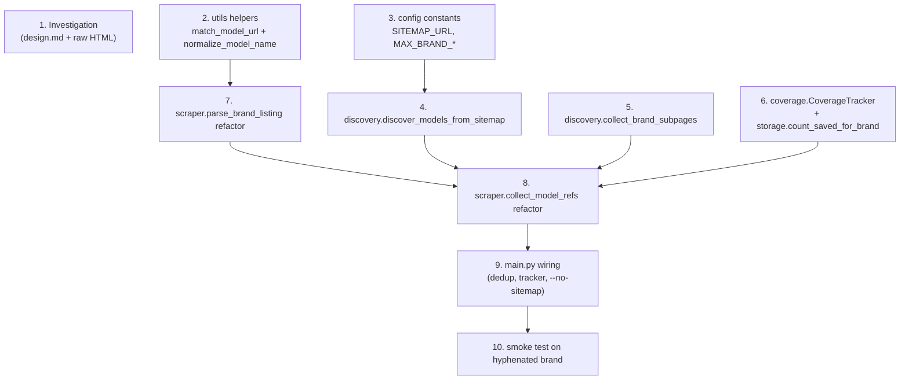

# Implementation Plan: tv-scraper-missing-models

## Overview

Restore full catalog coverage for the tel-spb.ru scraper by adding sitemap-driven discovery, a bounded brand sub-page BFS, hyphen-aware URL matching, and a composite dedup key, then surface per-brand coverage in a JSON report. The plan starts with a small investigation step that pins down the real sub-page URL shapes, then builds the pure helpers (`utils.py`, `config.py`, `discovery.py`, `coverage.py`, `storage.py`), refactors `scraper.py` and `main.py` to consume them, and ends with a smoke run against captured HTML for a hyphenated brand.

Implementation language: **Python** (matches existing codebase).

## Tasks

- [x] 1. Investigate sub-page URL patterns on tel-spb.ru
  - [x] 1.1 Capture sample brand-listing HTML for representative brands
    - Fetch the brand-root pages for `samsung`, `lg`, `sony`, and one hyphenated brand (`tcl-rowa` or `daewoo-electronics`) plus any year/pagination sub-pages they link to (depth 2 is enough)
    - Save raw responses verbatim under `data/raw/investigation/` using filenames like `<brand-slug>__root.html`, `<brand-slug>__page2.html`, `<brand-slug>__2020.html`, etc.
    - Use a one-off fetch script (plain `aiohttp` or `httpx`) that respects the existing polite delay; do not commit credentials or cookies
    - _Requirements: 1.4, 1.5, 2.1_

  - [x] 1.2 Update `design.md` with observed sub-page patterns
    - Append a `Sub-page patterns observed` subsection under section 5 (Sub-page detection rules)
    - Enumerate every concrete pattern seen (e.g. `?page=N`, `/<slug>/<year>/`, `/<slug>/led/?page=N`) with one example URL each
    - Note any hyphenated-brand quirks discovered (e.g. listings that emit absolute URLs vs relative hrefs)
    - Tighten the BFS rules table only if the captures justify it; otherwise leave the conservative rules in place and explain why
    - _Requirements: 1.4, 1.5_

- [x] 2. Add brand-slug-aware helpers to `utils.py`
  - [x] 2.1 Implement `match_model_url(path, known_brand_slugs)`
    - Add `MODEL_PATH_RE` and `match_model_url` exactly as specified in design section 3
    - Prefer the longest matching known slug; fall back to lazy regex when no known slug fits
    - Reject paths that contain a `/` after `/remont-tv-lcd/<slug>` (those are sub-pages, not models)
    - _Requirements: 2.1, 2.2, 2.3_

  - [x] 2.2 Hypothesis test for `match_model_url`
    - **Property 3: `match_model_url` is a round-trip when the brand is known**
    - **Validates: Requirements 2.1, 2.2, 2.3**
    - Generate `b` matching `[a-z0-9][a-z0-9-]*` and `m` matching `[a-z0-9][a-z0-9_-]*`; assert `match_model_url(f"/remont-tv-lcd/{b}-{m}", {b, *other_slugs}) == (b, m)` even when prefixes of `b` are also present in `known_brand_slugs`

  - [x] 2.3 Implement `normalize_model_name(name)`
    - Lower-case, strip, collapse internal whitespace to a single space (design section 3)
    - _Requirements: 3.2_

  - [x] 2.4 Hypothesis test for `normalize_model_name`
    - **Property 4: `normalize_model_name` is idempotent and whitespace-stable**
    - **Validates: Requirements 3.2**
    - Assert `normalize_model_name(normalize_model_name(s)) == normalize_model_name(s)` for arbitrary `s`, and that injecting any `\s+` runs into `s` does not change the output

- [x] 3. Add discovery constants to `config.py`
  - [x] 3.1 Add `SITEMAP_URL`, `MAX_BRAND_SUBPAGES`, `MAX_BRAND_DEPTH`
    - Define `SITEMAP_URL = f"{BASE_URL}/sitemap.xml"`, `MAX_BRAND_SUBPAGES = 200`, `MAX_BRAND_DEPTH = 3`
    - Keep existing `MODEL_PAGE_RE` untouched (still used by other consumers)
    - _Requirements: 1.1, 1.5_

- [x] 4. Implement sitemap-based model discovery in `discovery.py`
  - [x] 4.1 Implement `discover_models_from_sitemap(fetch, known_brand_slugs)`
    - Create new module `discovery.py` with the `FetchHtml` type alias and the function signature from design section 1
    - BFS over sitemap URLs starting at `SITEMAP_URL`; classify each document as `<sitemapindex>` (enqueue children) or `<urlset>` (extract `<loc>` URLs)
    - For every `<loc>`, parse the path with `match_model_url(path, known_brand_slugs)` and emit a `ModelRef` when it matches
    - Use a shared `set[str]` of visited sitemap URLs to guarantee termination on self-referencing indexes
    - Log a WARNING and continue when an individual sitemap document fails to fetch or parse
    - _Requirements: 1.1, 1.2, 5.1, 5.2_

  - [x] 4.2 Hypothesis test for `discover_models_from_sitemap`
    - **Property 1: Sitemap traversal recovers every Model_Page**
    - **Validates: Requirements 1.1, 1.2**
    - Generate synthetic sitemap trees (arbitrary `<sitemapindex>`/`<urlset>` fan-out and depth, mixed Model_Page and non-Model_Page URLs) backed by a dict-keyed fake `FetchHtml`
    - Assert the returned refs are exactly the set of Model_Page URLs in the tree, no duplicates, with no non-Model URLs

- [x] 5. Implement brand sub-page BFS in `discovery.py`
  - [x] 5.1 Implement `collect_brand_subpages(fetch, brand_slug, root_url, ...)`
    - BFS over in-domain links rooted at `root_url`, applying every rule in design section 5 (same host, brand-scoped path, not a Model_Page, `--only-led` honored, depth/count caps)
    - Visited key is `f"{canonical_path(url)}?{parsed.query}"` so `?page=2` and `?page=3` are visited as distinct sub-pages
    - Return the set of sub-page URLs to fetch (no parsing here — the caller drives the actual fetch + `parse_brand_listing`)
    - Emit an INFO log when the depth or count cap is hit
    - _Requirements: 1.4, 1.5, 7.5_

  - [x] 5.2 Hypothesis test for `collect_brand_subpages`
    - **Property 2: Brand sub-page BFS visits exactly the reachable, in-scope sub-pages**
    - **Validates: Requirements 1.4, 1.5, 7.5**
    - Generate small synthetic site graphs (each node tagged in-scope sub-page / out-of-scope / Model_Page) with a fake `FetchHtml` returning HTML containing `<a href>` to its children
    - Assert: the returned set is exactly the in-scope sub-pages reachable from the root, no Model_Page or out-of-scope page appears, total visits ≤ `MAX_BRAND_SUBPAGES`, max depth ≤ `MAX_BRAND_DEPTH`, no canonical key visited twice

- [x] 6. Implement coverage tracking
  - [x] 6.1 Create `coverage.py` with `CoverageTracker`
    - Implement `_BrandStats` dataclass and `CoverageTracker` per design section 6 (record_discovered / record_after_dedup / record_failure / finalize / to_json)
    - `finalize` reads `storage.count_saved_for_brand(brand)` for each tracked brand and emits one INFO log line per brand
    - _Requirements: 4.1, 4.2, 4.3, 4.4, 5.4_

  - [x] 6.2 Hypothesis test for `CoverageTracker`
    - **Property 6: Coverage tracker faithfully sums recorded events and produces a well-formed report**
    - **Validates: Requirements 4.1, 4.2, 5.4**
    - Generate sequences of `record_discovered` / `record_after_dedup` / `record_failure` calls and a stub storage with a deterministic `count_saved_for_brand`
    - Assert the finalized report contains every brand mentioned, each `discovered[source]` equals the sum of recorded counts for that source, `after_dedup` equals the last value recorded, `saved` equals the stub's return, `diff == discovered_total - saved`, and `failures` is the in-order list of recorded failure dicts

  - [x] 6.3 Add `count_saved_for_brand(slug)` to `storage.py`
    - One-liner running `SELECT COUNT(*) FROM tv_repairs WHERE LOWER(brand)=?`
    - Reuse the existing connection / cursor helpers; no schema change
    - _Requirements: 4.2, 7.1_

- [x] 7. Refactor brand-listing parsing in `scraper.py`
  - [x] 7.1 Use `match_model_url` in `parse_brand_listing` and `_parse_listing_rows`
    - Replace direct `re.search(MODEL_PAGE_RE, …)` calls with `match_model_url(urlparse(href).path, known_brand_slugs=self._known_slugs)`
    - Replace the `m.group(1).lower() != brand_slug.lower()` slug check with `parsed[0] != brand_slug.lower()`
    - Add `set_known_slugs(slugs: set[str])` on `TelSpbScraper` and have `discover_brands` populate it before any listing parse runs
    - Keep `MODEL_PAGE_RE` import-compatible for any other consumers; only the call sites change
    - _Requirements: 2.1, 2.2, 2.3_

- [x] 8. Refactor `collect_model_refs` to consume sub-page BFS + sitemap refs
  - [x] 8.1 Rewrite `TelSpbScraper.collect_model_refs(brand_slug, brand_root_url, sitemap_refs, tracker)`
    - Build the root URL list via `_brand_root_urls` honoring `--only-led` (Requirement 7.5)
    - Call `collect_brand_subpages` for each root, fetch each root + every BFS-discovered sub-page, parse each via `parse_brand_listing`
    - Thread the `tracker` through `_fetch_listing_html` so 404 / 5xx / network outcomes record into `tracker.record_failure` with the correct kind
    - Call `tracker.record_discovered(brand_slug, "sitemap", n)`, `record_discovered(brand_slug, "brand_page", n)`, `record_discovered(brand_slug, "sub_page", n)` with the actual counts
    - Merge sitemap refs of the brand with page refs and return the combined list (dedup happens at the call site)
    - _Requirements: 1.3, 1.4, 1.5, 1.6, 1.7, 5.1, 5.2, 5.3, 7.5_

- [x] 9. Wire discovery, dedup, tracker, and CLI flag into `main.py`
  - [x] 9.1 Update `run_scraper` end-to-end
    - Instantiate `CoverageTracker(run_id)` early; pass it into `collect_model_refs` and the per-worker `scrape_model` exception handler
    - Call `discover_models_from_sitemap(fetch, known_brand_slugs)` once at run-start (after `discover_brands`) unless `--no-sitemap` is set; pass the resulting list into `collect_model_refs`
    - Replace the URL-only dedup with the composite key `(brand.lower(), normalize_model_name(model_name), canonical_path(url))` in a `_dedup_key` helper; record `tracker.record_after_dedup(brand, count)` per brand after dedup
    - Add the `--no-sitemap` argparse flag to the existing CLI surface (do not change semantics of any existing flag)
    - On run end (success or graceful shutdown), call `tracker.finalize(storage)` and write the result to `DATA_DIR / f"coverage_{run_id}.json"` via `tracker.to_json`
    - _Requirements: 1.1, 1.6, 3.1, 3.2, 3.3, 3.4, 4.2, 4.3, 4.4, 7.3_

  - [x] 9.2 Hypothesis test for composite-key dedup
    - **Property 5: Dedup keeps exactly one ref per composite key**
    - **Validates: Requirements 3.1, 3.3, 3.4**
    - Generate arbitrary lists of `ModelRef` (varying brand casing, whitespace in `model_name`, query strings on `url`) and assert: dedup output length equals the number of distinct `(brand.lower(), normalize_model_name(model_name), canonical_path(url))` triples, every triple appears exactly once, and refs differing in any single coordinate are both retained

- [x] 10. Smoke run against captured fixtures
  - [x] 10.1 End-to-end smoke test on a hyphenated brand
    - Use `aioresponses` (or stub `aiohttp.ClientSession.get`) wired against the HTML samples committed in Task 1
    - Drive `run_scraper(--brand <hyphenated-slug>)` against the fixture; assert every Model_Ref produced by `parse_brand_listing` survives (i.e. hyphenated brand is no longer dropped)
    - Assert the coverage JSON written to `data/coverage_<run_id>.json` is well-formed: contains the brand key with non-zero `discovered_total`, an `after_dedup` value, a `saved` value, a `diff`, and a (possibly empty) `failures` list
    - Clean up any temp DB / coverage files created during the test
    - _Requirements: 2.2, 4.2, 4.4, 7.4_

## Notes

- Tasks marked with `*` are optional and can be skipped for a faster MVP; they are the property-based test sub-tasks.
- Each task references the granular sub-requirement clauses it satisfies; Task 1 is the only non-code task because it produces the fixture + design update needed before the rest of the plan can land safely.
- Property tests cover the six universal correctness properties from the design; example/integration tests cover the HTTP and SQLite edges.
- Task 10 acts as the final checkpoint — if it passes, hyphenated-brand recovery and coverage reporting are wired correctly end-to-end.

## Task Dependency Graph

```json
{
  "waves": [
    { "id": 0, "tasks": ["1.1", "2.1", "3.1", "5.1", "6.1", "6.3"] },
    { "id": 1, "tasks": ["1.2", "2.3", "4.1", "6.2"] },
    { "id": 2, "tasks": ["2.2", "5.2", "7.1"] },
    { "id": 3, "tasks": ["2.4", "4.2", "8.1"] },
    { "id": 4, "tasks": ["9.1"] },
    { "id": 5, "tasks": ["9.2", "10.1"] }
  ]
}
```


